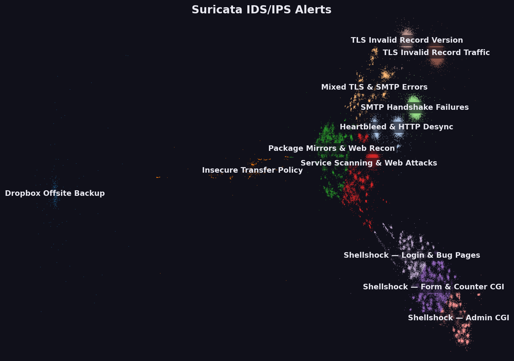

# Suricata IDS/IPS Alert Datamap

An interactive map of **59,579 deduplicated Suricata alerts** (496,578 raw alerts) drawn
from four packet captures: WRCCDC 2017 and 2018, the FIRST.org 2015 conference network,
and an internet honeypot. Points are laid out by the semantic similarity of the alert,
clustered into three labelled zoom levels, coloured by capture, and each one links out to
its Emerging Threats rule page.



Source data: <https://github.com/FrankHassanabad/suricata-sample-data/releases/tag/v4.0.0>

---

## Three ways to use it

| Artifact | Use it when |
|---|---|
| `suricata_alert_datamap_2026-08-12.html` (8.5 MB) | You want one portable file. Opens straight from disk, no server, no network. Email it, stick it on a share. |
| `pwa/` | You want to host it, or install it as an app that works offline. **Must be served over HTTP(S)** — see below. |
| `suricata_datamap_build.ipynb` | You want to rebuild or change it. Full reproducible pipeline from the raw `eve.json` files. |

---

## Hosting the PWA on GitHub Pages

1. Push this folder to a GitHub repo (`.gitignore` already excludes the 1.5 GB of raw
   captures and `release.zip`).
2. Repo **Settings → Pages → Source: GitHub Actions**. Do not pick "Deploy from a branch".
3. Push to `main`. `.github/workflows/pages.yml` validates the bundle and deploys `pwa/`.
4. The map is live at `https://<user>.github.io/<repo>/`.

The workflow fails the build if any precached file is missing, which is the failure mode
worth catching: a service worker whose `install` step 404s never activates, so the app
silently stops working offline.

### Any other static host

Copy `pwa/` to the web root. Requirements, in order of how likely they are to bite:

- **HTTPS is mandatory.** Service workers only register on a secure origin
  (`localhost` is exempt, which is why local testing works over plain HTTP).
- **Serve `.webmanifest` as `application/manifest+json`.** nginx and S3 don't know this
  extension by default and send `application/octet-stream`, which makes Chrome refuse to
  install the app. nginx: `types { application/manifest+json webmanifest; }`
- **Enable gzip or brotli for JSON.** The payload is 7.8 MB raw but **1.29 MB gzipped** —
  a 6× difference in load time. GitHub Pages does this automatically.
- **Don't cache `sw.js` for long.** `Cache-Control: no-cache` on that one file, so
  browsers pick up new versions. The service worker itself handles caching everything else.

Local preview:

```bash
cd pwa && python3 -m http.server 8000
# then open http://localhost:8000
```

Opening `pwa/index.html` directly from disk will **not** work — `file://` blocks the
`fetch()` for the data. The app detects this and says so instead of failing blank. Use the
single-file HTML if you need a no-server option.

---

## What's in `pwa/`

```
index.html               27 KB   app shell: the viewer, no data inlined
data/datamap.json       7.8 MB   the point payload (1.29 MB gzipped on the wire)
manifest.webmanifest             name, icons, standalone display
sw.js                            service worker: precaches everything on install
icons/                           192/512/180 px + a maskable 512, drawn from the real layout
.nojekyll                        stops Pages running the bundle through Jekyll
```

The shell and the data are cached separately and the cache name carries a hash of both, so
editing the viewer doesn't force a re-download of the 7.8 MB payload, and publishing new
data invalidates the old cache automatically.

**Offline behaviour:** the service worker precaches the whole map on install, so once the
page has loaded once it works with no network. Navigations fall back to the cached shell.
Requests to other origins are never intercepted — the rule-lookup links always go to the
live site.

---

## Reading the map

- **Zoom** changes the label layer: 12 coarse clusters → 48 → 144.
- **Colour** is the capture the alert came from (legend, bottom right). honeypot-2018 is
  only 150 points, so it gets high-contrast pink to stay findable.
- **Click a point** for an info card: signature, category, severity, src→dst with ports,
  protocol, host, URI, first-seen timestamp, and how many raw alerts collapsed into that
  point. The card's **ET rule** link opens that Suricata rule's page on
  `threatintel.proofpoint.com`. Plain clicks never navigate.
- **Search** matches across every tooltip field and the cluster labels.

**Point density is not incidence.** Sources are sampled deliberately, not proportionally
(the two WRCCDC captures are cut to 27,500 composites each; the honeypot and FIRST captures
are kept whole). Use the `count` field on the card for volume.

---

## Rebuilding

Open `suricata_datamap_build.ipynb` and run it top to bottom. It re-parses the raw
`eve.json` files, rebuilds the corpus, pins the layout, renders the HTML, and regenerates
`pwa/`. Read the **Limitations and traps** section at the bottom first — particularly #4,
which explains why `layout_coords.npy` and `cluster_assignments.npz` must stay committed:
the layout is not reproducible across machines, and without those two files a rebuild
silently relabels the entire map.

To regenerate only the PWA after re-rendering the HTML:

```bash
python3 build_pwa.py
```
